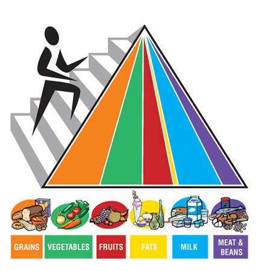
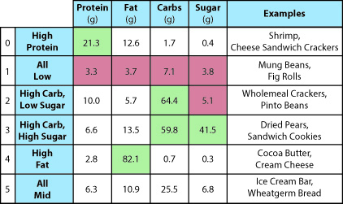
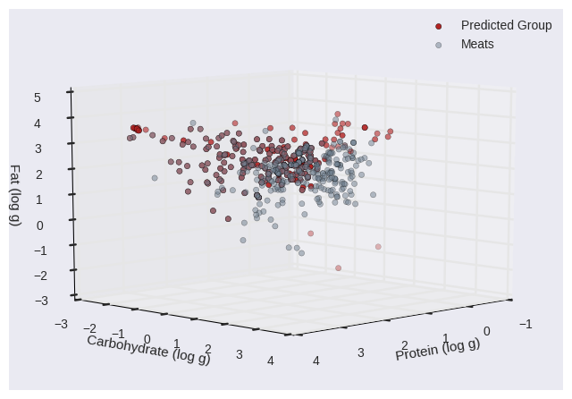
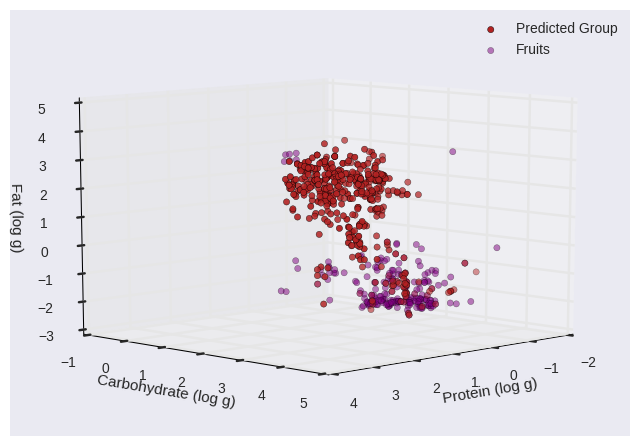
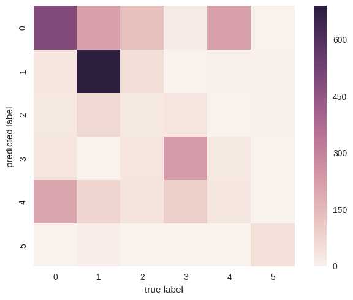

# Should you Follow the Food Groups for Dietary Advice?

#### Kaitlyn Keil and Kevin Zhang

#### Data Science Spring 2017

*Figure 1: The Food Pyramid, with the 6 basic food groups and their servings sizes. This is the staple reference point of many diets as well as a source of disillusionment due to its constant appearance in the grade school education system.*

Beginning from childhood, most of us who participated in the education system have been taught the Food Pyramid, consisting of the basic food groups: Grains, Vegetables, Fruits, Meats, Dairy, and Fats/Oils. The categorization, interactions, and suggested serving sizes of these groups are shown in Figure 1 above. Growing up through the years, some people decide that the Food Pyramid is outdated and discover their own balanced diet, while others follow it like the Food Bible and apportion their meals according to the servings listed in the Pyramid. This controversy over social acceptance of the Food Pyramid surfaces an important question: are the food categories found in the Food Pyramid truly the correct groupings for food, and if not, just how far off are they?

To answer the question, we utilize the [United Kingdom Nutrient Databank](http://tna.europarchive.org/20110116113217/http://www.food.gov.uk/science/dietarysurveys/dietsurveys/), created by the Food Standards Agency in 2002. This database is a relatively recent and extensive publication of the composition of common foods consumed in the UK. It contains over 3000 foods and outlines their nutrient content, from macronutrients (i.e. fat, carbohydrates, etc) to vitamins and minerals. This compositional information is often used to inform food choices and create personalized meal plans, thus lending itself to being used for categorization. The databank also includes most staple foods as well as popular foods from the previous decade, making it a relevant and powerful dataset in terms of the question.

To evaluate the "correct" groupings of food, which is inherently subjective, we define groups to be correct if they share similar compositions. In other words, if their nutrient content and biological characteristics are comparable, we consider them to be part of the same category. In line with the way the Food Pyramid categorizes food, we will be using the major macronutrients to categorize food. This means we will be using the amount of carbohydrates, fats, and proteins in a given amount of food, as well as the water and sugar content. Each entry in the databank is based off of a 100 g portion of the food.

We will be using [K-Means Clustering](https://github.com/jakevdp/PythonDataScienceHandbook/blob/master/notebooks/05.11-K-Means.ipynb) as the principle tool to see if the Food Pyramid's food groups are correct. The K-Means algorithm will search for 6 clusters, the supposed 6 major food groups, based on the macronutrient criteria. We will be examining the clusters that result from K-Means to investigate the food groups. In addition, we will also be accuracy scores of K-Means predictions and confusion matrices to more quantitatively look into how similar the foods in the food groups really are.

For more information on the database used, check out the [UK's website](http://tna.europarchive.org/20110116113217/http://www.food.gov.uk/multimedia/pdfs/cofuserdoc.pdf)

To take a look at our source code, check out our [ipython notebook](https://github.com/kzhang8850/MLFood/blob/master/Report3.ipynb)

We ran the K-Means algorithm on the UK Nutrient Databank, and discovered that the food groups aren't as coherent as people make them out to be. Our algorithm found 6 clusters, which then were compared to every single food group, and discovered more qualitative mismatches than matches. Figure 2 describes the groups found by the average value of the macronutrients, as well as a couple of exmples of foods found in that category. All cluster graphs can be found in the source code, but here we will show one of the best matched clusters, and one of the worst.

*Figure 2: The six groups found by the k-means clustering, labeled by the average values of macronutrient composition. A couple of examples for each category is shown in the final column.*

To begin, Figure 3 below shows one of the best matched clusters we found, which was the Meats food group.

*Figure 3: The Meat group and the K-Means prediction cluster represented on a scatter plot with Fats, Carbs, and Protein in log scale as criteria. Note that the two clusters are essentially on top of each other, showing that our K-Means algorithm could correctly guess the meat group just purely off of its nutrient and biological content. This is reasonable as meats in general have very high protein levels, giving their group a unique and distinctive characteristic.*

The graph in Figure 3 shows a 3D scatterplot of the Meats group and the K-Mean prediction cluster that best fit the meat cluster. The datapoints are represented in terms of Carbs, Proteins, and Fats on a log-log-log scale. Just looking at the clusters, it is very clear that the red points, which belong to the predicted K-Means cluster, are co-located with many of the gray points, which belong to the Meat group. While there to appear to be some edge cases and outliers that don't coincide, it is quite apparent that the centers of the two clusters are almost on top of each other, suggesting that they are more or less the same cluster, with some of the difference attributed to prediction error or non-linearity. Thinking about it from a nutritional standpoint, this is reasonable, as the Meats group is uniquely characterized by high protein content, and it is fairly easy to group similarly high protein foods together. It would also not be unreasonable to suggest that different meats probably have comparable fat and carbohydrate content as well, since muscles and meats on animals roughly consist of the same components. In the case of the Meat food group, there is substantial evidence to believe that this categorization is quite accurate.

However, not all clusters are as close as this, and in fact a large number are not. Figure 4 below shows the Fruits group with a potential K-Means cluster that could represent Fruits.

*Figure 4: The Fruits group and a potential predicted K-Means cluster represented on a scatter plot with Fats, Carbs, and Protein in log scale as criteria. In this case, the two clusters are almost completely separated from each other, showing that they have very little similarity. In reality, fruits are a very diverse group, as the origins of the foods and their compositions are widespread. Looking into the source code, there is no particular K-Means cluster that predicted the Fruits group.*

Figure 3 shows a 3D scatterplot using the same parameters as the Meats group in Figure 2, except this time showing the Fruits groups and a potential K-Means cluster that could "represent" the Fruits group. As can be seen, the two groups are completely different, with both their centers in substantially different areas of the nutrient space. The only areas where they might coincide slightly is actually near their outliers and edge cases. This shows that this K-Means cluster does not predict the Fruits groups very well. Looking into the source code at all the combinations, it is clear that none of the 6 clusters are well fit to the Fruits group, meaning that the Fruits group is not an accurate categorization of the foods that represent the group. This makes sense because fruits as a food are very diverse, from Kiwis to Bananas to Peaches. Unlike meats, people eat different fruits for different nutritional values, such as Apples for fiber, or Bananas for potassium, etc. The origins of each fruit and their biological compositions cover a wide range on the food spectrum, thus using a single categorization such as the fact that they "have seeds" falls short of capturing the nutritional diversity of this group.

Finally, we show the holistic results of our K-Means algorithm in a more quantitative fashion. Figure 5 below is a confusion matrix that represents the predictions of K-Means labels against the actual labels of the foods.

*Figure 5: A confusion matrix of our K-Means algorithm's results. A perfect prediction would be all of the main diagonal squares being black, as each label was correctly predicted. In our case, the predictions are more scattered, suggesting that the food groups are not as accurate as people thought in categorizing food correctly. The darkest square, located at the intersection of the label '1', is representative of meats. Along the real label axis, '0' is representative of vegetables, '1' meats, '2' dairy, '3' cereals, '4' fruits, and '5' oils.*

Figure 5 shows the matrix of predictions against their true labels in a kind of heat map display, where the cells are a combination of a predicted label on each food's true label, where in this case true label refers to the preconceived food groups. Correct predictions lie on the main diagonal, and any other square is an incorrect prediction. Thus, a perfect prediction from our K-Means algorithm would be seen if the main diagonal of the matrix was black squares, as that would mean that all true labels were correctly predicted. However, in our case, the predictions are more scattered about the matrix, showing that the food groups are not as accurate as we believe them to be. As shown in Figures 3 and 4, the Meat groups (label 1) has a high accuracy rate, but the Fruits group (label 4) has a very low accurate rate. Dairy (label 2) and Fats/Oils (label 5) are also poor, and the rest are near the middle. Looking into the source code, we calculate the accuracy score of our K-Means algorithm, which is the numerical calculation of this confusion matrix as a percentage of correct predictions. The accuracy score of the K-Means algorithm was about **53%**, showing that the food groups are only accurate in its method of categorization for about half the foods listed among the basic food groups.

With this data, we have evidence to believe that the the basic food groups taught to people via the Food Pyramid are not a particularly accurate representation of the different foods out there in the world, and that perhaps those who believed the Pyramid was outdated and moved on to create their own balanced diet were on to something.

There were some limitations to our model, which are mentioned here. First, we used a basic K-Means machine learning model on the data, which has the potential to cluster things inaccurately, particularly in the case of not reaching the global optima and thus clustering incorrectly because the centers were not properly initialized. We took the K-Means algorithm at face value and believe that it optimized the initial center placement for us, as it is unfeasible to test out every center and examine the results, but there is potential for error.

Another potential limitation is the fact that our K-Means algorithm was linear, and thus it can't account for potential non-linear boundaries. Our goal was just to see if the food group clusters existed as prescribed by the Food Pyramid, thus for our purposes the linearity of our algorithm should be enough to prove that boundaries exist, even if there are edge cases that cross boundaries. We do admit that the food groups might not have a linear grouping.

Finally, another limitation might be the dataset, which is from 2002 and is from an archived website. It was the most complete and relevant dataset we could find in a reasonable amount of time, and thus we believe that it was pertinent to gaining useful insights. However, food compositions and food tastes might have changed since 2002, since we are now 15 years in the future, so it's possible that the food groups that we were looking for are no longer exactly what they are today. We also did not take into account all aspects of food composition, such as fibre content or vitamins.

Some steps to continue forward with this project include looking into non-linear methods of clustering. For example, we could potentially use a manifold learning method to preprocess the data before handing it over to K-Means, which might improve the accuracy or insights gained. In addition, it might also be useful to include more criteria in our algorithm, as we really only looked carbohydrates, proteins, and fats. Potentially looking into other factors and including those might create a stronger model to find more meaningful clusters of food groups.
